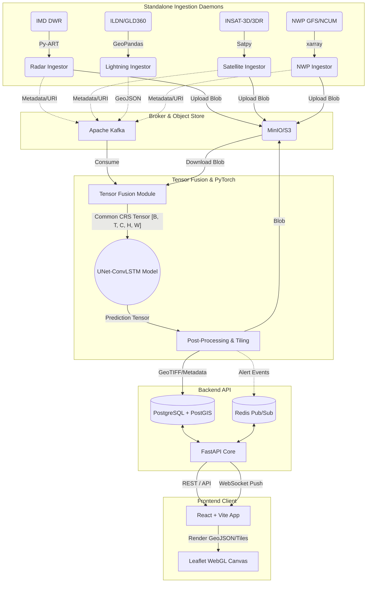

**🔗 Frontend URL:** [StormSight Dashboard (Local Dev)](http://localhost:5173/dashboard) | **Repository:** [github.com/varshneydevansh21/SIH_PS72](https://github.com/varshneydevansh21/SIH_PS72)

---

# 🌩️ StormSight - Mission-Critical Meteorological Nowcasting

**Smart India Hackathon 2026 | Problem Statement 072**
*AIML based Nowcasting of thunderstorm and lightning using atmospheric observation including multiple radars, satellite, lightning and model data.*

---

## 1. Executive Mission & System Architecture

**Mission Statement**: StormSight is a state-of-the-art, multi-modal spatio-temporal AI engine designed for the high-precision nowcasting of severe convective weather, thunderstorms, and lightning. By synthesizing heterogeneous atmospheric data streams into a unified deep learning pipeline, StormSight delivers actionable intelligence to minimize loss of life and infrastructure damage.

**Target Operational Metrics**:
*   **Lead Time**: 0 to 120 minutes.
*   **Temporal Resolution**: 10–15 minute prediction intervals.
*   **Spatial Resolution**: 2 km Cartesian grid spacing.
*   **Latency Budget**: < 90 seconds (end-to-end: sensor ingestion to front-end WebSocket broadcast).
*   **Target Accuracy**: Critical Success Index (CSI / Threat Score) $\ge$ 0.55 for $\ge$ 35 dBZ reflectivity thresholds.

### 1.1 Dataflow & Architecture Diagram



---

## 2. Data Source Integration Specifications

StormSight executes a highly synchronized multi-sensor data fusion pipeline. The table below enforces the ingestion contracts.

| Source | Data Provider | Native Format | Ingestion Cadence | Spatial Resolution | Processing Library | Target Normalized Output |
| :--- | :--- | :--- | :--- | :--- | :--- | :--- |
| **Radar** | IMD DWR | NetCDF4 / HDF5 | 10 min | ~1-2 km (Radial) | `arm-pyart`, `wradlib` | CAPPI Cartesian Grid (dBZ) |
| **Satellite** | MOSDAC (INSAT) | HDF5 | 15-30 min | 4 km (IR) | `satpy`, `pyresample` | TIR1, TIR2, WV (Kelvin $\rightarrow [0,1]$) |
| **Lightning** | ILDN / GLD360 | JSON / CSV (Points) | Continuous / 1 min | Point Coordinates | `geopandas`, `scipy` | 2D Gaussian KDE Heatmap |
| **NWP** | GFS / NCUM | GRIB2 | 6-hourly | ~13 km to 25 km | `xarray`, `cfgrib` | CAPE, CIN, Bulk Shear Grids |

*Note: Due to Kafka's `message.max.bytes` limit (default 1MB), dense binary payloads (Radar/Satellite/NWP) are written to MinIO. Kafka transmits lightweight event metadata (timestamps, bounding boxes, MinIO URIs).*

---

## 3. Mathematical & ML Pipeline Specifications

### 3.1 Input Tensor Formulation
The Tensor Fusion module aligns all data sources spatially (Reprojected to a localized UTM CRS via `rasterio`/`gdal`) and temporally.

**Input Tensor Shape**: $[B, T_{in}, C, H, W]$
*   $B$: Batch Size (Inference $= 1$, Training $= 8$).
*   $T_{in}$: Historical time steps $= 4$ (covering the past 60 minutes at 15-min intervals).
*   $C$: Channels $= 7$.
    *   $C_0$: Radar Reflectivity ($Z_H$) normalized $[0, 1]$ (where $1.0 = 70$ dBZ).
    *   $C_1$: Satellite TIR1 Brightness Temperature.
    *   $C_2$: Satellite WV (Water Vapor).
    *   $C_3$: Brightness Temperature Difference (TIR1 - WV).
    *   $C_4$: Lightning Density (Gaussian KDE applied to sparse point strikes).
    *   $C_5$: NWP CAPE (Convective Available Potential Energy).
    *   $C_6$: NWP CIN (Convective Inhibition).
*   $H, W$: Spatial dimensions $= 512, 512$ (at 2 km resolution, covering $1024 \times 1024$ km).

### 3.2 Output Prediction Formulation
**Output Tensor Shape**: $[B, T_{out}, C_{out}, H, W]$
*   $T_{out}$: Future time steps $= 8$ (Nowcasting up to $+120$ minutes).
*   $C_{out}$: Channels $= 2$ ($C_0$: Predicted Radar Reflectivity, $C_1$: Predicted Lightning Strike Probability).

### 3.3 Loss Function
To combat the blurriness inherent in standard MSE and to penalize missed detections of severe storms, StormSight optimizes a custom composite loss function:
$$ \mathcal{L}_{total} = \alpha \cdot \mathcal{L}_{WB-MSE} + \beta \cdot (1 - \text{SSIM}) + \gamma \cdot \mathcal{L}_{Soft-CSI} $$
*(Where $\mathcal{L}_{WB-MSE}$ is Weighted Balanced MSE that exponentially weights pixels where true $Z \ge 35\text{ dBZ}$).*

---

## 4. Database & Stream Schema Contract

### 4.1 PostGIS SQL Schemas
```sql
-- Radar & Satellite Spatio-Temporal Metadata
CREATE TABLE radar_frames (
    id UUID PRIMARY KEY,
    timestamp TIMESTAMPTZ NOT NULL,
    radar_station VARCHAR(10) NOT NULL,
    minio_uri VARCHAR(255) NOT NULL,
    bbox GEOMETRY(Polygon, 4326) NOT NULL
);

-- Lightning Events (Vector Data)
CREATE TABLE lightning_events (
    id UUID PRIMARY KEY,
    timestamp TIMESTAMPTZ NOT NULL,
    peak_current_ka FLOAT,
    polarity SMALLINT CHECK (polarity IN (-1, 1)),
    geom GEOMETRY(Point, 4326) NOT NULL
);

-- Nowcast Prediction Metadata
CREATE TABLE nowcast_predictions (
    id UUID PRIMARY KEY,
    forecast_reference_time TIMESTAMPTZ NOT NULL,
    valid_time TIMESTAMPTZ NOT NULL,
    lead_time_minutes INTEGER NOT NULL,
    minio_uri_reflectivity VARCHAR(255) NOT NULL,
    minio_uri_lightning_prob VARCHAR(255) NOT NULL,
    bbox GEOMETRY(Polygon, 4326) NOT NULL
);

-- Derived Severe Weather Alerts
CREATE TABLE severe_weather_alerts (
    id UUID PRIMARY KEY,
    issued_at TIMESTAMPTZ NOT NULL,
    valid_until TIMESTAMPTZ NOT NULL,
    severity_level VARCHAR(20) NOT NULL, -- 'WARNING', 'WATCH', 'ADVISORY'
    event_type VARCHAR(50) NOT NULL,     -- 'THUNDERSTORM', 'EXTREME_LIGHTNING'
    alert_polygon GEOMETRY(Polygon, 4326) NOT NULL
);

CREATE INDEX idx_lightning_geom ON lightning_events USING GIST (geom);
CREATE INDEX idx_alerts_geom ON severe_weather_alerts USING GIST (alert_polygon);
```

### 4.2 Kafka Topics & Partitioning
*   `ingest.radar.raw` (Partitioned by `radar_station`)
*   `ingest.satellite.insat` (Partitioned by `channel`)
*   `ingest.lightning.strikes` (Partitioned by spatial quadkey/geohash)
*   `inference.nowcast.completed` (Consumed by Backend API for WebSocket push)

---

## 5. API & WebSocket Specifications

### 5.1 RESTful Endpoints (FastAPI)
*   `GET /api/v1/nowcast/forecast?lat={lat}&lon={lon}&radius={km}`
    *   Returns JSON array of time-series predictions (Reflectivity & Lightning Probability) for the given point/radius.
*   `GET /api/v1/alerts/active`
    *   Returns GeoJSON `FeatureCollection` of active `severe_weather_alerts` polygons.
*   `GET /api/v1/radar/latest`
    *   Returns pre-signed MinIO URLs for rendering the most recent observed radar tiles.

### 5.2 WebSocket Protocol (`/ws/live-stream`)
The WebSocket provides a low-latency unidirectional firehose to connected Leaflet clients.
*   **Payload Format**: JSON.
*   **Client Heartbeat**: Client must send `{"type": "ping"}` every 30s. Server responds with `{"type": "pong"}`.
*   **Server Push Event (Alert)**:
    ```json
    {
      "type": "NEW_ALERT",
      "data": {
        "severity": "WARNING",
        "polygon_geojson": { "type": "Polygon", "coordinates": [...] }
      }
    }
    ```
*   **Server Push Event (New Frame Available)**:
    ```json
    {
      "type": "NOWCAST_FRAME_READY",
      "data": {
        "valid_time": "2026-09-26T10:45:00Z",
        "tile_url_template": "https://minio.local/tiles/nowcast_Z/10_45/{z}/{x}/{y}.png"
      }
    }
    ```

---

## 6. Local Developer Setup

### 6.1 Environment Variables (`.env.example`)
```ini
# Core Configuration
PROJECT_NAME="StormSight PS072"
ENVIRONMENT="development"
CORS_ORIGINS="http://localhost:5173,http://localhost:3000"

# PostgreSQL / PostGIS
POSTGRES_USER=stormuser
POSTGRES_PASSWORD=stormpass
POSTGRES_DB=stormsight_db
POSTGRES_PORT=5432
DATABASE_URL=postgresql+asyncpg://${POSTGRES_USER}:${POSTGRES_PASSWORD}@db:${POSTGRES_PORT}/${POSTGRES_DB}

# MinIO / Object Storage
MINIO_ROOT_USER=admin
MINIO_ROOT_PASSWORD=password123
MINIO_ENDPOINT=minio:9000
MINIO_BUCKET_RADAR=radar-raw
MINIO_BUCKET_PREDS=nowcast-predictions

# Kafka & Redis
KAFKA_BOOTSTRAP_SERVERS=kafka:9092
REDIS_URL=redis://redis:6379/0

# ML Inference
DEVICE=cuda  # or 'cpu', 'mps'
HALF_PRECISION=True
```

### 6.2 Docker Compose Initialization
```bash
# 1. Initialize environment
cp backend/.env.example backend/.env

# 2. Build and spin up the infrastructure layer (DB, Redis, Kafka, MinIO)
docker compose -f backend/docker-compose.yml up -d db redis zookeeper kafka minio

# 3. Apply PostGIS database migrations
docker compose -f backend/docker-compose.yml run --rm backend alembic upgrade head

# 4. Start the Application and Ingestion Daemons
docker compose -f backend/docker-compose.yml up -d backend ingestor_dwr ingestor_lightning

# 5. Start Frontend UI
cd frontend && npm install && npm run dev
```
