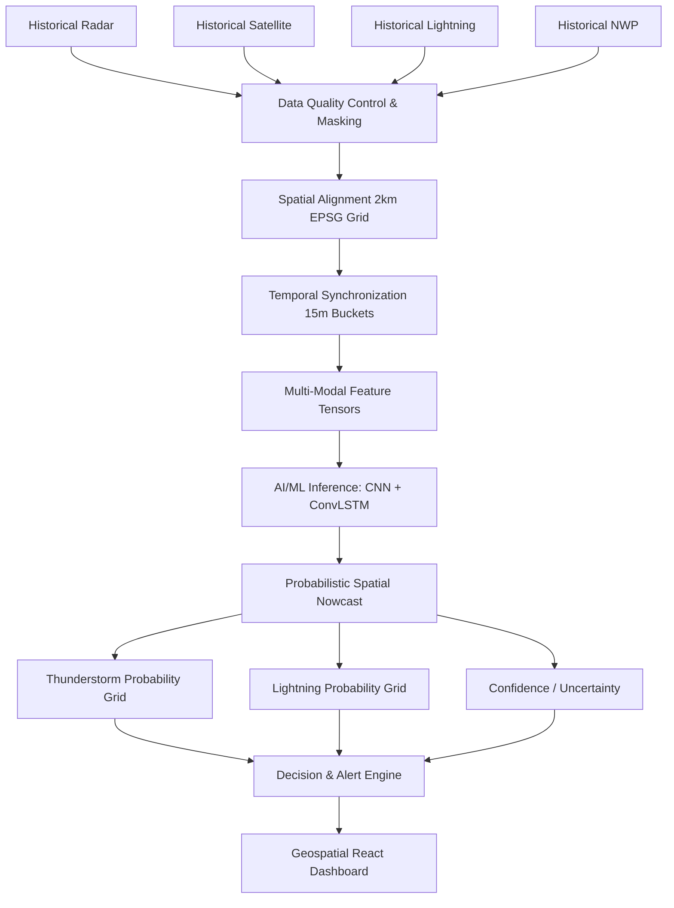

# SIH 2026 Presentation Master Plan & System Architecture Specification

**Problem Statement:** SIH26072 / PS26072 - *AIML based Nowcasting of thunderstorm and lightning using atmospheric observation including multiple radars, satellite, lightning and model data.*
**Organization:** Ministry of Earth Sciences (MoES) | India Meteorological Department (IMD)
**Category:** Software | **Theme:** Disaster Management

---

## 1. MOST IMPORTANT CONTEXT: CURRENT DEVELOPMENT STATUS

This project is approaching the problem from a **presentation-first** architecture phase. The document explicitly distinguishes three states:

*   **CURRENT (Existing):** Basic scaffolded infrastructure (FastAPI, React, Docker). *Note: The core ML model and ingestion pipelines are NOT yet built.* Remnants of prior cyclone tracking projects (PS70) exist but are obsolete for this use case.
*   **PROPOSED (MVP / SIH Presentation):** A historical replay system using a CNN-ConvLSTM model to demonstrate spatial probability nowcasting over a specific historical thunderstorm event.
*   **FUTURE (Post-MVP):** Real-time live data streaming, multi-node cloud deployment, and advanced Transformer-based architectures.

> **CRITICAL RULE:** No performance metrics (Accuracy, CSI, FAR) are claimed as achieved. All performance numbers discussed are **Targets** to be evaluated against baselines.

---

## 2. UNDERSTANDING PS26072

The core concept is NOT "build a weather app." The task is **short-term AI/ML nowcasting (0–2 hours) of thunderstorms and lightning using continuously arriving heterogeneous atmospheric observations.**

The system focuses on:
1.  **Detection:** Identifying current convective states.
2.  **Tracking:** Observing historical storm motion vectors.
3.  **Nowcasting:** Predicting *where* thunderstorm/lightning activity is likely to occur in the next $+15, +30, \dots, +120$ minutes.

---

## 3. RECOMMENDED SCIENTIFIC DIRECTION & SYSTEM WORKFLOW

### System Workflow Steps:
1. **Acquire** raw historical observations.
2. **Validate** data for corruption.
3. **Normalize** formats to scaled arrays.
4. **Reproject** to a common Cartesian grid.
5. **Synchronize** into discrete temporal sequences ($t-60$ to $t$).
6. **Fuse** into multi-channel tensors.
7. **Infer** future probability grids via AI.
8. **Threshold** probabilities into Alert Polygons (PostGIS).
9. **Expose** via FastAPI.
10. **Render** historical replay on the frontend dashboard.

---

## 4. MODEL ARCHITECTURE & MULTI-MODAL FUSION

*   **Baseline Model:** Optical-flow / advection-based extrapolation (used solely as a benchmark).
*   **Proposed MVP ML Model:** CNN Encoder + ConvLSTM Temporal Modeling.
    *   *Why:* The task requires both spatial pattern recognition (CNN) and temporal evolution modeling (ConvLSTM). It is computationally feasible for an MVP compared to massive Vision Transformers.
*   **Fusion Strategy (Hybrid Fusion):**
    *   Dense grids (Radar, Satellite, NWP) are processed through separate lightweight CNN encoders.
    *   Sparse data (Lightning) is converted to a dense probability heatmap via Kernel Density Estimation (KDE), then encoded.
    *   Features are concatenated before being passed to the temporal ConvLSTM blocks.

---

## 5. DATA REPRESENTATION & SOURCES

**Common Spatiotemporal Representation:**
*   **Grid:** 2 km x 2 km spatial resolution over a defined bounding box.
*   **Temporal Interval:** 15-minute steps.
*   **Observation Window:** Past 60 minutes (4 frames).
*   **Forecast Horizon:** Target up to +120 minutes.

**Data Source Matrix:**
| Source | Data Type | Contribution | Access Status | Role |
| :--- | :--- | :--- | :--- | :--- |
| **Radar** | Reflectivity (dBZ) | Precipitation structure | Public/Historical (IMD) | Primary |
| **Satellite** | INSAT IR / WV | Cloud top temps, moisture | Public/Historical (MOSDAC) | Primary |
| **Lightning** | Flash coordinates | Convective intensity | Access dependent | Primary |
| **NWP** | CAPE, CIN | Atmospheric instability | Public | Secondary |

### Data Availability & Fallback Strategy
If a modality is missing, the system must not crash. We propose using **explicit boolean mask channels** and zero-filling during training. This forces the network to learn fallback relationships (e.g., relying heavily on Satellite if Radar is unavailable).

---

## 6. LABEL DESIGN & VALIDATION

**Label Design:**
*   **Input:** Multi-modal tensors $t-60 \dots t$.
*   **Target:** Probability fields $P(\text{Event at } t+15, \dots, t+120)$.
*   *Thunderstorm Proxy:* Radar reflectivity $\ge 35$ dBZ (Threshold pending meteorological validation).
*   *Lightning Proxy:* Lightning strike density $> 0$ in grid cell.

**Validation Metrics:**
*   Probability of Detection (POD)
*   False Alarm Ratio (FAR)
*   Critical Success Index (CSI)
*   *Strategy:* ML Nowcasts will be plotted against persistence baselines to demonstrate skill across lead times.

---

## 7. UNCERTAINTY & DECISION LAYER

*   **MVP Uncertainty:** Simple confidence representation derived from data availability (e.g., lower confidence if radar is missing).
*   **Decision Policy:** ML Probability $\rightarrow$ Calibration $\rightarrow$ Thresholds.
    *   *Proposed Alert States:* Normal ($P < 0.3$), Watch ($0.3 \le P < 0.6$), High Risk ($P \ge 0.6$).

---

## 8. SOFTWARE ARCHITECTURE (BACKEND & FRONTEND)

*   **Backend:** Python, FastAPI, PostgreSQL/PostGIS (for alert polygons), MinIO (for raster/tensor storage), Docker.
    *   Modular monolith design exposing `/api/nowcast`, `/api/alerts`, and `/api/replay`.
*   **Frontend:** React (Next.js/Vite), TypeScript, Tailwind CSS, Leaflet.
    *   **User Experience:** Map-centric dashboard focusing on: Observe $\rightarrow$ Predict $\rightarrow$ Risk $\rightarrow$ Decide.
    *   Features: Timeline scrubber, probability map overlays, alert side-panel, historical replay controls.

---

## 9. HISTORICAL REPLAY (MVP DEMONSTRATION)

We will NOT fabricate a fake "live" model. The strongest MVP demonstration is:
1.  Select a known historical severe thunderstorm event.
2.  Sequentially feed historical observations into the dashboard.
3.  Display the model's generated nowcast.
4.  Allow judges to compare the *prediction* vs the *observed evolution*.

---

## 10. FULL SYSTEM VS MVP DEFINITION

| Component | SIH Proposed Architecture | MVP Implementation |
| :--- | :--- | :--- |
| **Satellite** | Multi-channel | Single IR channel |
| **Radar** | Network mosaic | Single DWR station |
| **Lightning** | Real-time GLD360/ILDN | Simulated/Historical or Excluded |
| **NWP** | GFS/NCUM | Excluded for MVP simplicity |
| **AI Model** | Hybrid Fusion Transformer | CNN + ConvLSTM |
| **Dashboard** | Live Real-time feed | Historical Replay |

---

## 11. CLAIM AUDIT

| Claim | Status | Safe Wording for PPT |
| :--- | :--- | :--- |
| **Model Architecture** | Proposed | "Proposed ConvLSTM architecture" |
| **Data Sources** | Planned | "Utilizing historical IMD/MOSDAC datasets" |
| **Accuracy/CSI** | Target | "Targeting improved CSI over advection baselines" |
| **Real-time processing** | Proposed | "Architected for low-latency inference" |
| **Deployment** | Future | "Designed for cloud-native deployment" |

---
---

# PART II: FINAL PRESENTATION BLUEPRINT

*(Use this section exactly as written for the 6-slide PPT).*

## SLIDE 1: TITLE PAGE
*   **Content:**
    *   Smart India Hackathon 2026
    *   **Problem Statement:** PS26072 - AIML based Nowcasting of thunderstorm and lightning using atmospheric observation...
    *   **Organization:** Ministry of Earth Sciences (MoES) | IMD
    *   **Theme:** Disaster Management | **Category:** Software
    *   **Team Name:** [Insert Team Name]
*   **Speaker Note:** Keep it professional and brief. Establish credibility.

## SLIDE 2: IDEA TITLE & PROPOSED SOLUTION
*   **Idea Title:** StormSight: Multi-Modal Spatiotemporal Nowcasting
*   **Problem:** Traditional numerical models take hours to run. Thunderstorms develop in minutes, requiring rapid, short-term predictions.
*   **Solution:** A deep-learning engine that fuses Radar, Satellite, and Lightning data to generate high-resolution, 15-minute probability maps up to 2 hours in advance.
*   **Differentiation:** Advection models (Optical Flow) only move existing storms. Our AI models non-linear storm *initiation* and *decay* using atmospheric constraints.
*   **Visual:** A clean, horizontal 4-step pipeline: `Data (Icons)` $\rightarrow$ `AI Brain` $\rightarrow$ `Probability Maps` $\rightarrow$ `Dashboard Alert`.

## SLIDE 3: TECHNICAL APPROACH
*   **Main Message:** A feasible, highly-engineered data pipeline.
*   **Visual:** Use the Mermaid diagram (Section 3 above), visually stylized.
*   **Tech Stack Box:** Python, PyTorch, FastAPI, PostGIS, React, Leaflet.
*   **Speaker Emphasis:** Explain *Hybrid Fusion*. "We don't just dump data into a model. We carefully align diverse spatial grids, encode them, and use ConvLSTM to capture the storm's temporal evolution."

## SLIDE 4: FEASIBILITY & VIABILITY
*   **Main Message:** We have a credible roadmap from MVP to operational system.
*   **MVP Scope:** Focus on historical replay of a single severe event using Radar + Satellite IR.
*   **Data Strategy:** Relying on publicly available historical IMD and MOSDAC archives for training.
*   **Risk Mitigation:** If radar data drops, our architecture uses explicit missing-data masks, allowing the model to fallback to satellite inference gracefully.
*   **Development Roadmap:** `Data Acquisition` $\rightarrow$ `Baseline` $\rightarrow$ `MVP Model` $\rightarrow$ `Backend` $\rightarrow$ `Historical Dashboard Demo`.

## SLIDE 5: IMPACT & BENEFITS
*   **Main Message:** Translating probabilities into actionable early warnings.
*   **Operational:** Enhances IMD's short-term situational awareness.
*   **Social & Safety:** Earlier warnings for aviation, utilities, and emergency services.
*   **Scalability:** Can be piloted on a single DWR station and scaled horizontally to the national grid.
*   **Visual:** Map of stakeholders (Aviation, Agriculture, Disaster Mgmt) radiating from the application.

## SLIDE 6: RESEARCH & REFERENCES
*   **Main Message:** Grounded in meteorological science.
*   **Content:**
    *   IMD Data Portals / MOSDAC.
    *   Literature on ConvLSTM / Deep Learning for Precipitation Nowcasting (e.g., Shi et al., 2015).
    *   Standard baseline frameworks (e.g., PySTEPS).
*   **Speaker Note:** "Our architecture is built on proven meteorological data and established spatiotemporal ML research, tailored specifically for the IMD's requirements."

---

## CONTENT RESERVOIR (For Q&A & Judge Defense)

*   **Why not just use a Transformer?** Vision Transformers require massive data and compute to converge. ConvLSTM is highly proven for MVP spatiotemporal sequence prediction and trains efficiently.
*   **How do you measure false alarms?** Using FAR (False Alarm Ratio) alongside CSI. Maximizing accuracy is flawed because severe weather is a rare event (class imbalance); predicting "no storm" always yields 99% accuracy.
*   **What if an API feed goes down?** The frontend falls back to the last known prediction, and the ML pipeline uses modality dropout to predict with reduced confidence.
*   **How does this differ from an ordinary weather app?** Consumer apps show historical radar or generic daily forecasts. We calculate the *future spatial probabilities* using raw sensor data on a 2km grid every 15 minutes.
